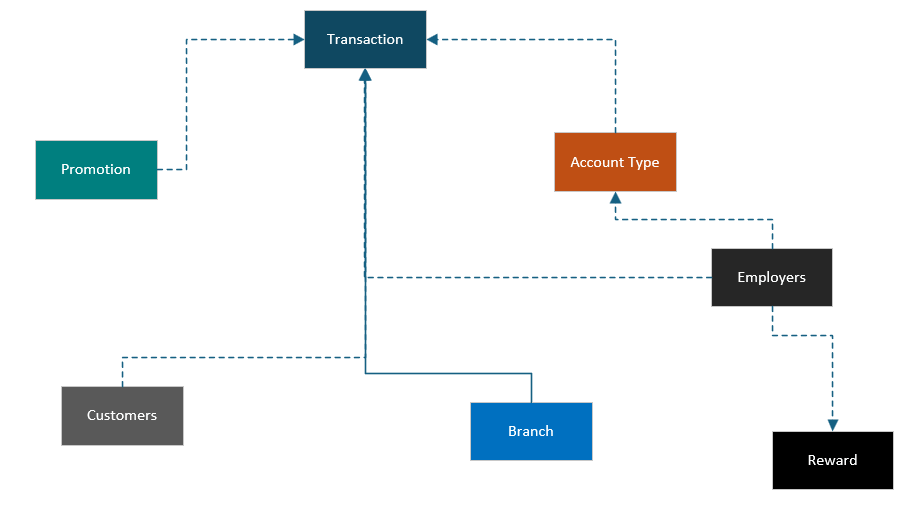
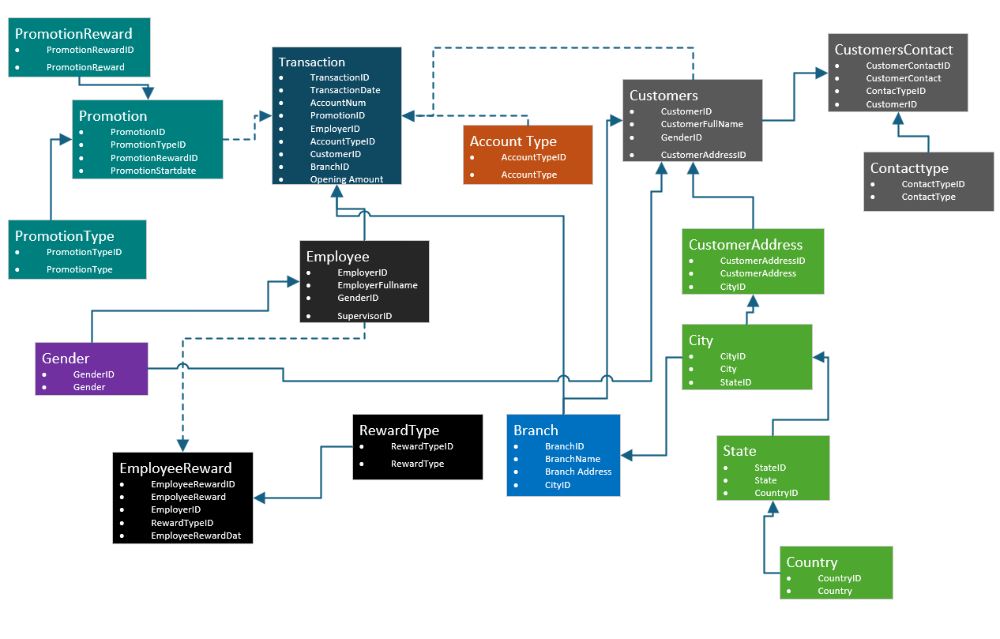
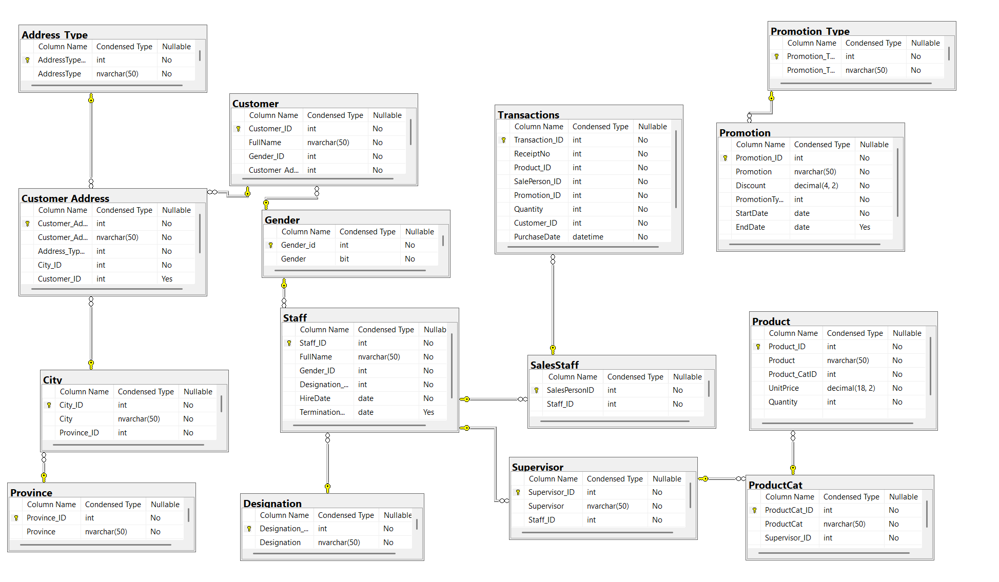

# 🏦 Bank Product Promotion Data Modelling Project

## 📘 Introduction
This project involves designing and implementing a **transactional data model** to capture and analyze data for a bank’s promotional campaign across Canada.  
The bank launched a **customer acquisition promotion** that rewards new customers with an **iPad** for opening at least one account from different account types.  
In addition, **bank staff** receive incentives for every account they help open.  

The goal of this project was to develop a robust **conceptual, logical, and physical data model** to manage customer, account, and staff data efficiently and support reporting and analytics.

---

## 🧩 Problem Statement
The bank required a system to:
- Track all **customers** participating in the promotion.  
- Capture **multiple contact details** (address, phone, etc.) for each customer.  
- Record **accounts opened**, including account type and branch.  
- Manage **staff activities**, as staff can operate across multiple branches and are linked to supervisors.  
- Monitor **promotional performance metrics** — such as number of accounts opened per branch, staff reward counts, and customer eligibility for rewards.

The system needed to support **real-time transactional updates** and serve as a foundation for **reporting and visualization**.

---

## 🧠 Skills Demonstrated
- **Database Design** (Conceptual, Logical, and Physical Modeling)  
- **Entity-Relationship Modelling (ERD)** using tools like *draw.io*, *Lucidchart*, or *Power BI Model View*  
- **Data Normalization** (to 3NF)  
- **SQL Data Definition Language (DDL)** – Table creation, keys, and constraints  
- **ETL Design** and data preparation  
- **Power BI Data Modelling & Visualization**  
- **Business Analysis and Data Storytelling**

---

## 🧱 Data Modelling

### **1. Conceptual Model**

 

  

**Relationships:**
- One *Customer* can have many *Contacts*  
- One *Customer* can open many *Accounts*  
- One *Branch* can have many *Accounts*  
- One *Staff* can open many *Accounts* and work at multiple *Branches*  
- Each *Staff* is assigned to one *Supervisor*

---

### **2. Logical Model**
Defined the structure, attributes, and relationships with primary and foreign keys.

 

  

---

### **3. Physical Model**
Implemented using **SQL Server** (or any RDBMS):
- Defined data types (e.g., INT, VARCHAR, DATE)  
- Enforced **Primary Key**, **Foreign Key**, and **Not Null** constraints  
- Indexed key columns to optimize query performance  

  

---

## 🧾 Conclusion
The data model successfully:
- Captures detailed promotional and account-opening transactions  
- Supports flexible queries and reporting  
- Enables the bank to monitor both **customer engagement** and **staff performance** in real time  

The **normalized structure** ensures data integrity and efficient updates across all entities.

---

## 💡 Recommendations
- Implement a **data warehouse** for long-term historical tracking and performance analytics  
- Integrate **automated ETL pipelines** using tools like Azure Data Factory or SSIS  
- Introduce **data governance rules** for maintaining data quality  
- Extend Power BI dashboards with predictive analytics to forecast future campaign success  

---

## 🧰 Tools & Technologies
- **SQL Server** – Data storage & physical modelling  
- **Visio** – Conceptual and Logical ERD design  

---

## 📁 Project Structure
